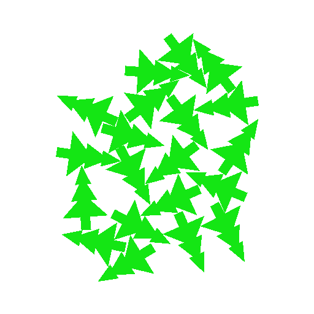

# Kaggle Santa 2025 - Christmas Tree Packing Challenge

Competition: https://www.kaggle.com/competitions/santa-2025

The code is in `tree_packing/` and uses `zig` version `0.16.0`.


```shell
zig build test --summary all
zig build run-pack -- --random 20 300 1000
```

The `run-pack` command will search for a configuration of packed trees by applying a perturbation to a subset of them.


